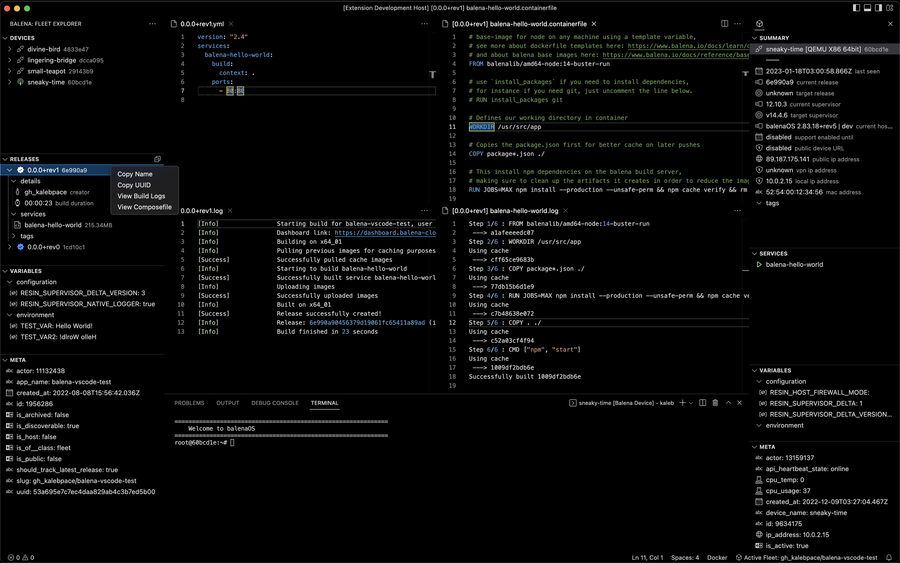
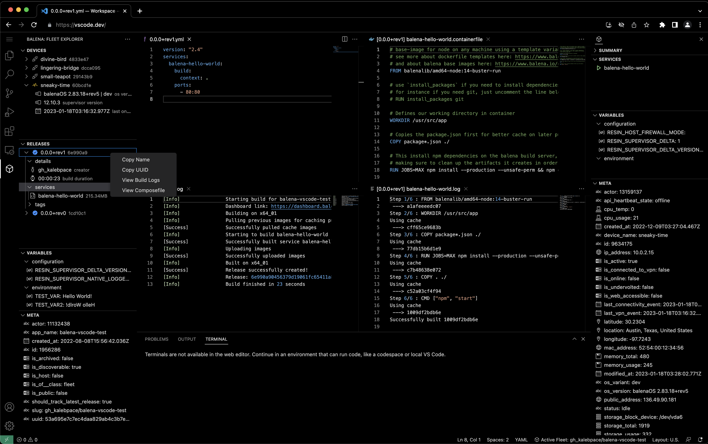

# Balena VS Code
| | |
|-------------|--------|
| [OpenVSX](https://open-vsx.org/extension/kalebpace/balena-vscode)     |   |
| [VSCode Marketplace](https://marketplace.visualstudio.com/items?itemName=kalebpace.balena-vscode)     |    | 
| [Github Releases](https://github.com/balena-vscode/balena-vscode/releases) |  |

## Getting Started
1. Install extension
2. [Get API Token from Balena](https://docs.balena.io/learn/manage/account/#api-keys)
2. Open Command Palette, run `Balena: Login to Balena Cloud`, select `API Token`
3. Open Command Palette, run `Balena: Fleet Explorer: Select Active Fleet`

## Features
- [x] Fleet Explorer
    - [x] Open live Logs of any Device
    - [x] Open SSH Terminal of any Device (Native-client only)
    - [x] List Devices, online statuses, and summaries
    - [x] List Releases, build statuses, tags, and open relevant container files (e.g. Dockerfile, docker-compose.yml)
    - [x] List (read-only) Variables, for both Fleet configuration and global environments
    - [x] List miscellaneous (meta) properties for the currently selected Fleet
    - [ ] Edit Variables List
    - [ ] Toggle Local-mode
    - [ ] Power commands (Reboot, Power-off, etc)
- [x] Device Inspector
    - [x] In-depth device summary
    - [x] Show Service statuses
    - [x] Device configuration and environment variables
    - [ ] Edit Service statuses
    - [ ] Edit Variables
- [ ] Open Balena Support

## Previews
### Native/Desktop

### Browser
